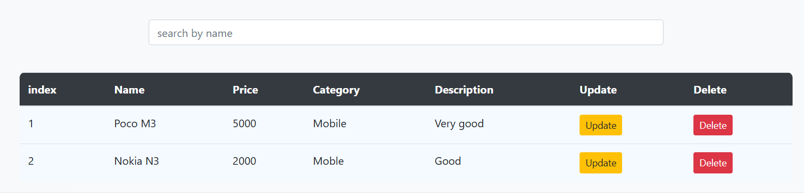
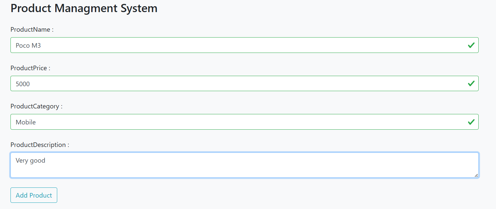
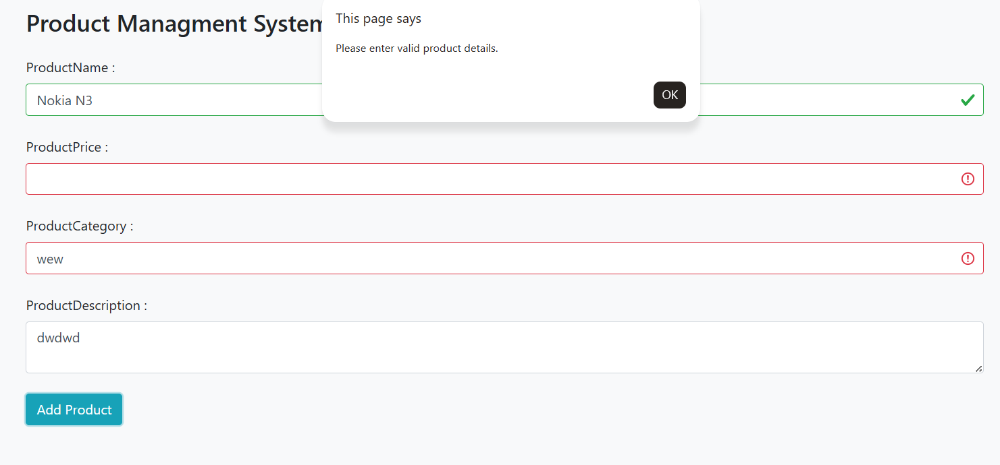

# 📦 Product Management System

## 📌 Project Overview
A lightweight, fast, and responsive client-side web application designed to manage product inventories efficiently. Built entirely with Vanilla JavaScript, this project demonstrates strong foundational skills in DOM manipulation, state management using browser APIs, and strict data validation.

## 🚀 Live Demo
> **[Click here to view the live project](https://hassanmahdi-2002.github.io/product-management-system/)**

## 📸 Screenshots

### Main Interface & Data Table


### Real-time Regex Form Validation



## 🚀 Key Features
* **Complete CRUD Operations:** Users can seamlessly Add, Read, Update, and Delete product entries dynamically without page reloads.
* **Data Persistence:** Utilizes browser `localStorage` to ensure product data is saved and retrieved effectively across sessions.
* **Robust Form Validation:** Implements Regular Expressions (Regex) to strictly validate the product name, price, and category before any data submission, providing real-time UI feedback (valid/invalid states).
* **Real-Time Search:** Features a highly responsive search functionality that filters and displays products by name instantly as the user types.
* **Clean & Responsive UI:** Designed with a user-friendly table interface, styled using custom CSS and Bootstrap for full responsiveness and structured layouts.

## 🛠️ Tech Stack
* **Frontend:** HTML5, CSS3, Bootstrap 5.
* **Logic & State:** Vanilla JavaScript (ES6+), DOM Manipulation, LocalStorage API.

## ⚙️ How to Run
1. Clone the repository to your local machine:
   ```bash
   git clone [https://github.com/hassanMahdi-2002/product-management-system.git](https://github.com/hassanMahdi-2002/product-management-system.git)
2.  Open the `index.html` file in any modern web browser.
3.  Start adding products and testing the CRUD functionality!

##👨‍💻 Author
Hassan Mahdi

Computer Engineer & Full-Stack Developer

GitHub: @hassanMahdi-2002
